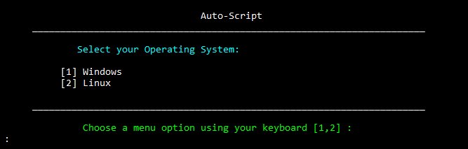
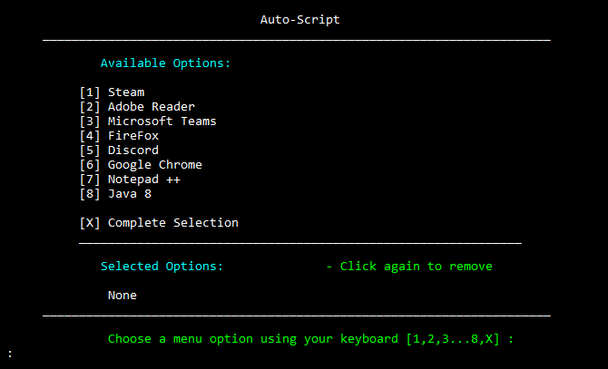

<h1 align="center">Auto-Script</h1>
This script automates the installation of desired programs in an orderly and predefined sequence. It ensures that all needed software is installed whilst saving time and reducing human error.

## Screenshots

 <a href="https://github.com/Brybry-Ink/Auto-Script"> 

 <a href="https://github.com/Brybry-Ink/Auto-Script"> 

## How it Works
1. Download the .exe or .ps1 file from [Releases](https://github.com/Brybry-Ink/Auto-Script/releases) and follow the prompts
2. User selects the operating system (Windows or Linux)
3. A menu is displayed for selecting apps to install
4. Based on the selection, a script is generated
5. For Windows, it runs automatically. For Linux, it creates a '.sh' file with instructions to run it

## Features
Automatic installation of selected programs.
- Steam
- Adobe Reader
- Microsoft Teams
- Firefox
- Discord
- Google Chrome
- Notepad++
- Java 8

## OS's Supported
- Windows 10/11
- Linux Ubuntu

## Built With
- [PowerShell](https://github.com/PowerShell/PowerShell) - Programming Language Used
- [WinGet](https://github.com/microsoft/winget-cli) - Windows package manager
- [Debian](https://www.debian.org/distrib/packages) - Debian based Linux package manager

## License
Auto-Script is open-sourced under the [MIT License](https://github.com/Brybry-Ink/Auto-Script?tab=MIT-1-ov-file). Feel free to use, modify, and distribute as per the terms of the license.
